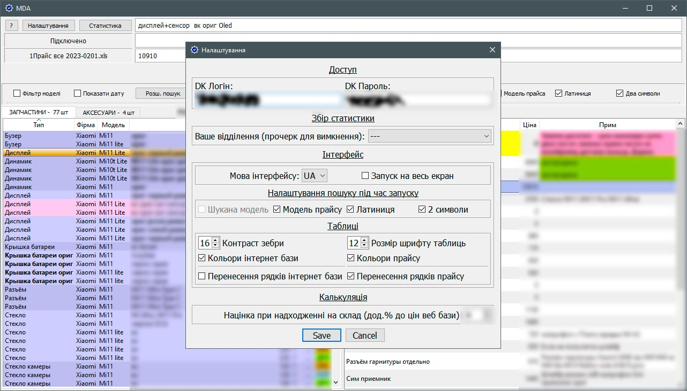

### About:
This application was made as Pet project that must simplify job to me and my colleagues.
### Purpose:
The main purpose of the app is to reduce time for searching data - one of the most often action.
### Application features:
+ Aggregates data from *.xml price document, checks parts availability in parsed web database, and shows combined result.  
+ Mostly controllable with keyboard, that also speeds up working process.  
+ Converts search inputs in ascii, so you free of switching keyboard language.  
+ Collects statistic data from client apps and shows combined graphs.
+ Have a language choice for UI.
### Used technologies:

  

### Screenshots:

